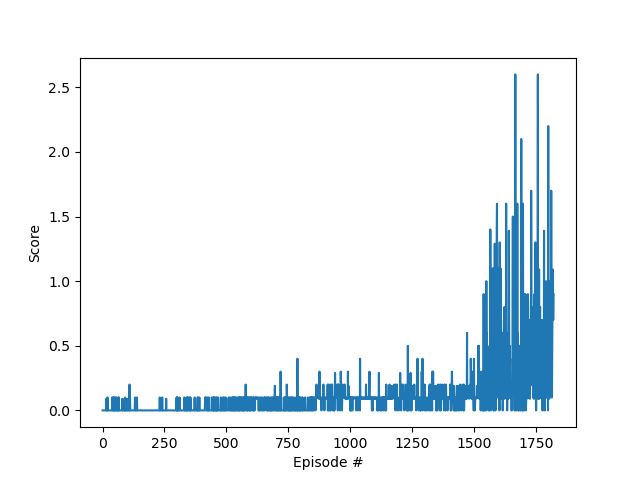

# Continuous Control in Reacher Environment

This project is intended to solve Tennis Environment. This project was created as part of
[Deep Reinforcement Learning Nanodegree](https://www.udacity.com/course/deep-reinforcement-learning-nanodegree--nd893) course.
All of the code is in PyTorch (v1.5) and Python 3.

## Environment
In this environment, two agents control rackets to bounce a ball over a net. If an agent hits the
ball over the net, it receives a reward of +0.1. If an agent lets a ball hit the ground or hits the
ball out of bounds, it receives a reward of -0.01. Thus, the goal of each agent is to keep the ball in play.

The observation space consists of 8 variables corresponding to the position and velocity of the
ball and racket. Each agent receives its own, local observation. Two continuous actions are available,
corresponding to movement toward (or away from) the net, and jumping.

The task is episodic, and in order to solve the environment, the agents must get an average score of +0.5
(over 100 consecutive episodes, after taking the maximum over both agents). Specifically,

- After each episode, we add up the rewards that each agent received (without discounting), to get a score
for each agent. This yields 2 (potentially different) scores. We then take the maximum of these 2 scores.
- This yields a single score for each episode.

## Getting started

Download the whole repository.

### Packages

You should have installed Python 3.8 as well. Create new python virtual environment. Install required python packages in this virtual environment:
1. Pytorch (1.5.0)
2. numpy
3. matplotlib
From the root of this repo run `pip -q install ./python`. This will install packages required for connection with the environment.

### Unity Environment

The repository already contains a prebuilt environment for Windows (64-bit).

If you have another OS, download the environment from one of the links below and replace:

 - Linux: [click here](https://s3-us-west-1.amazonaws.com/udacity-drlnd/P3/Tennis/Tennis_Linux.zip)
 - Max OSX: [click here](https://s3-us-west-1.amazonaws.com/udacity-drlnd/P3/Tennis/Tennis.app.zip)
 - Windows (32-bit): [click here](https://s3-us-west-1.amazonaws.com/udacity-drlnd/P3/Tennis/Tennis_Windows_x86.zip)
 - Windows (64-bit): [click here](https://s3-us-west-1.amazonaws.com/udacity-drlnd/P3/Tennis/Tennis_Windows_x86_64.zip) 

### Run
Train: `python tennis_ddpg.py train`

Evaluate: `python tennis_ddpg.py test <checkpoint>`

## Results

By using [DDPG algorithm](https://arxiv.org/pdf/1509.02971.pdf) the agent was able to solve the environment after about 1700 episodes! See the video below.

 ## Additional info
 
 See report for additional information.
 